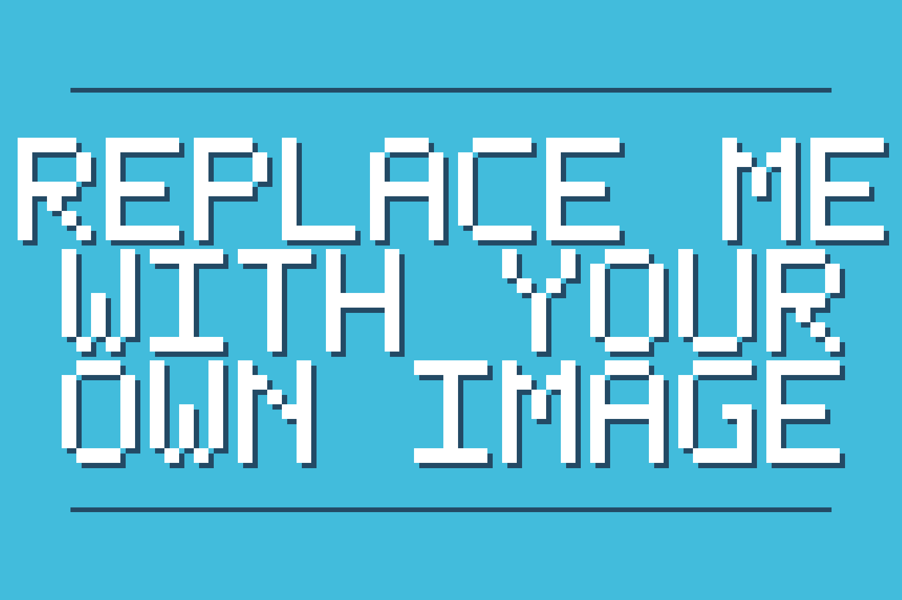
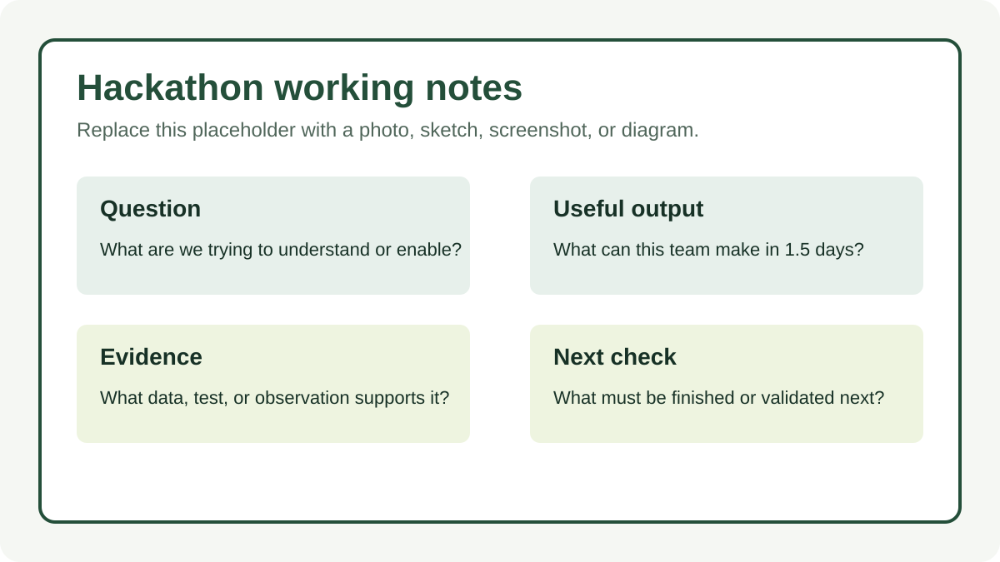

!!! tip "Start here — September 15–16, 2026"
    This page is your team’s shared workspace, public project story, and final report-out. Keep **Instructions on** while working, turn them **off** to preview the public page, and select **Hackathon Report Out** for the short presentation view.

    Follow one clear path: **Question → Evidence → Representation → Build → Interpret → Uncertainty → Stewardship → Share**.

    Minimum success is one focused question, one visible artifact or well-documented attempt, one evidence-backed learning, one honest uncertainty, and one responsible next step. Technical complexity is optional.

!!! warning "Before writing on a public site"
    Use only material appropriate for public GitHub. Do not add culturally sensitive knowledge, protected locations, private or community-controlled data, personal information, restricted stewardship material, or claims of review or approval that have not occurred.

# This is now my awesome project

!!! note "First edit"
    Replace the page title and heading with your project name. Add a short subtitle that tells visitors what you are exploring.

    [Edit the team page in Markdown](https://github.com/CU-ESIIL/hackathon_group_OASIS/edit/main/docs/index.md){ .md-button target="_blank" rel="noopener" }

*One sentence describing the question, place, or possibility your team is exploring.*

!!! note "Replace the hero image"
    Upload a wide public-safe image to `docs/assets/hero/` and replace `hero.png`, or update the Markdown path above. Write alt text that explains the image.

    [Open the hero-image folder](https://github.com/CU-ESIIL/hackathon_group_OASIS/tree/main/docs/assets/hero){ .md-button target="_blank" rel="noopener" }

[See the completed OLC example](olc-example.md){ .md-button .md-button--primary }
[See the completed fire example](example.md){ .md-button }
[Open the Hackathon directions](instructions.md){ .md-button }

## People { #people }

!!! note "Day 1 — quick introductions"
    Add one short row per teammate. Share what you know, what you hope to learn, and which role you can take first. Roles can change as the work changes.

    [Edit People](https://github.com/CU-ESIIL/hackathon_group_OASIS/edit/main/docs/index.md){ .md-button target="_blank" rel="noopener" }

| Name | Affiliation | Contact | Starting role |
|---|---|---|---|
|  |  |  |  |

## Team Norms and Decision Making { #team-norms-and-decision-making }

!!! note "Keep this fast"
    Choose two or three norms and one simple decision rule. A five-minute agreement now can prevent a long disagreement later.

Our team norms:

- ...
- ...
- ...

Our decision rule:

...

## Our Question 📣 { #project-question .oasis-report-out-section }

!!! note "Question → Evidence"
    Write one question narrow enough to investigate during the Hackathon. Name what would count as progress. The question can change when the evidence shows it should.

    The three OLC pathways are parallel options, not ability levels:

    - **Guided Explorer:** explain what available evidence shows and does not show.
    - **Data Investigator:** compare evidence, coverage, or assumptions.
    - **Technical Extender:** test or extend a reproducible method.

    [Edit the question and evidence](https://github.com/CU-ESIIL/hackathon_group_OASIS/edit/main/docs/index.md){ .md-button target="_blank" rel="noopener" }

Our working question:

...

What would count as progress by noon on September 16:

...

!!! question "Sovereignty checkpoint 1 — Who framed the question?"
    Who helped define it? Whose priorities does it reflect? Who might frame it differently? Do the available public data fit the question, or are they merely convenient?

    Record unresolved answers honestly. Completing this prompt is not sovereignty certification or a substitute for a locally appropriate data-governance process.

## Why This Matters 📣 { #why-this-matters .oasis-report-out-section }

!!! note "Connect the work to people without overclaiming"
    Explain the potential value and intended audience. Do not describe an impact, partnership, consultation, or endorsement that has not happened.

This matters because:

...

People who might use, question, or improve this work:

...

## What We Tried to Build 📣 { #what-we-tried-to-build .oasis-report-out-section }

!!! note "Representation → Build"
    Choose the smallest useful artifact: a figure, comparison, map, notebook, workflow, model, prototype, educational resource, or clearly documented attempt. Scientific usefulness matters more than software complexity.

    [Edit the intended build](https://github.com/CU-ESIIL/hackathon_group_OASIS/edit/main/docs/index.md){ .md-button target="_blank" rel="noopener" }

By the end of the Hackathon, we tried to make:

...

Our chosen pathway and why it fit:

...

*Working notes showing the question, intended artifact, and evidence boundary.*

## Data and Evidence { #data-and-evidence }

!!! note "Source, place, period, meaning"
    For every important dataset, record who produced it, the place or geographic support it represents, the observation period, and what one value physically means. Add links and citations.

| Dataset | Source | Place | Period | What it measures |
|---|---|---|---|---|
| ... | ... | ... | ... | ... |

!!! warning "Public data is a boundary, not blanket permission"
    This Hackathon uses public datasets so teams can focus on environmental data science, building, interpretation, and communication during a short event. Public availability does not mean the data represent every relevant perspective or authorize every interpretation or use.

    **Accessible ≠ interpretable ≠ actionable**

    - **Accessible:** Can we obtain and analyze the data?
    - **Interpretable:** What claims can the observations support?
    - **Actionable:** Is there enough evidence, context, relationship, review, and authority for a real decision?

!!! question "Sovereignty checkpoint 2 — What does the evidence represent?"
    Does its spatial and temporal scale match the question? What is missing? Who collected and transformed it? Could someone with different knowledge of the place interpret it differently? Should the evidence change the question?

## Methods and Tools { #methods-and-tools }

!!! note "Document the build as it happens"
    Record enough detail for another person to understand what you tried. Keep failed attempts and obstacles when they teach something useful.

Methods, tools, or approaches we tried:

| Approach | What we did | What happened |
|---|---|---|
| ... | ... | ... |

[Open shared code](https://github.com/CU-ESIIL/hackathon_group_OASIS/tree/main/code){ .md-button target="_blank" rel="noopener" }

### Working visual or output

*Describe what this artifact shows, what evidence produced it, and why it matters.*

### Failed attempts and useful obstacles

- ...

!!! info "Want to go further? CubeDynamics is optional"
    CubeDynamics can support reproducible labeled-array workflows, but it is not required for a successful project. As of September 2026, the official project is prerelease and has no public PyPI or GitHub Release installation. Use only a facilitator-provided, checksum-verified setup, keep the scientific question ahead of the software, and see the [optional CubeDynamics guide](instructions/cubedynamics.md).

## What We Made { #what-we-made }

!!! note "Artifact first"
    Link the strongest artifact directly. If it is incomplete, say what works, what does not, and what another team would need to continue.

- **Main artifact:** ...
- **Code or notebook:** ...
- **Reusable data or output:** ...
- **How to reproduce or continue:** ...

## What We Learned 📣 { #what-we-learned .oasis-report-out-section }

!!! note "Interpret"
    Separate the observation from the interpretation. Point to the figure, analysis, comparison, or artifact supporting every main claim.

    [Edit the learning and main figure](https://github.com/CU-ESIIL/hackathon_group_OASIS/edit/main/docs/index.md){ .md-button target="_blank" rel="noopener" }

**Observation — what happened:** ...

**Evidence — what supports it:** ...

**Interpretation — what we think it means:** ...

*Figure 1. Write a claim-oriented caption: what pattern or result should a reader see, and what evidence boundary matters?*

### Claim ladder

| Level | Team statement |
|---|---|
| **What We Observed** | ... |
| **What We Think** | ... |
| **What We Don’t Know** | ... |
| **What We Should Not Claim** | ... |

## What Didn’t Work { #what-didnt-work }

What we tried, what happened, and what another team should know:

...

## What Remains Uncertain 📣 { #what-remains-uncertain .oasis-report-out-section }

!!! note "Uncertainty is a result"
    Name the largest evidence gap, assumption, alternative interpretation, or validation need. A precise limit is more useful than false certainty.

    [Edit the uncertainty](https://github.com/CU-ESIIL/hackathon_group_OASIS/edit/main/docs/index.md){ .md-button target="_blank" rel="noopener" }

What these data or artifacts cannot tell us:

...

What would strengthen or challenge our interpretation:

...

!!! question "Sovereignty checkpoint 3 — Before sharing"
    Who could be affected by this interpretation? Who is absent? Who should help interpret or review a continuation? Is everything on this page appropriate for public GitHub?

    Naming a reviewer or collaborator does not imply that they reviewed, approved, authorized, or endorsed the work.

## What’s Next 📣 { #whats-next .oasis-report-out-section }

!!! note "Stewardship → Share"
    Choose one next technical step and one next relationship, interpretation, or review step. Keep them specific enough that another person could act.

    [Edit next steps](https://github.com/CU-ESIIL/hackathon_group_OASIS/edit/main/docs/index.md){ .md-button target="_blank" rel="noopener" }

Next technical step:

...

Next stewardship or collaboration step:

...

## Who Should Be Involved Next { #who-should-be-involved-next }

Potential roles or perspectives—not claims of consultation or approval:

- ...

What those people should help frame, interpret, question, or review:

...

## Code, Data, Citation and Reuse { #code-data-citation-and-reuse }

!!! note "Final handoff"
    Add stable source links, licenses or terms, citations, and concise reproduction notes. Run the [site completion coach](_site_health.md) for reminders; it is an editing aid, not scientific, ethical, sovereignty, or community approval.

- **Source curriculum:** [OLC Climate Resiliency and Digital Sovereignty Learning Lab](https://github.com/olc-techsupport/Education-Climate-Resiliency-Digital-Sovereignty) [@olcClimateResiliency]
- **Code/notebooks:** ...
- **Data and terms:** ...
- **Reuse notes:** ...

If you use this template, cite the OASIS repository [@oasisProjectTemplate] and preserve attribution for every external dataset, method, and artifact.

{{ references }}
