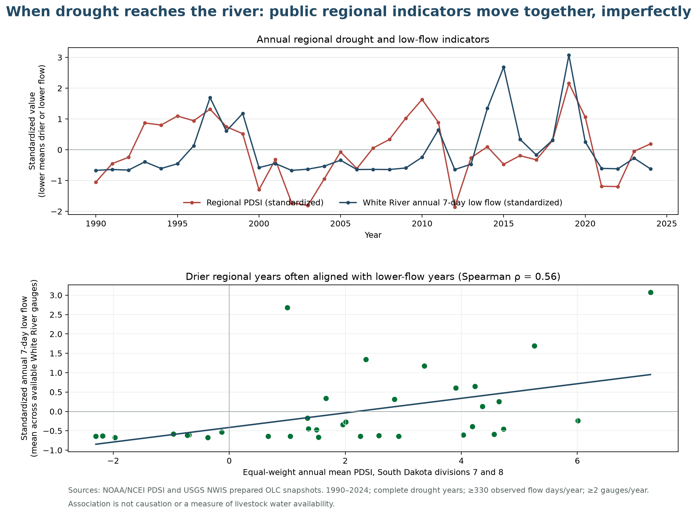

!!! tip "How to use this annotated example"
    With **Instructions on**, callouts explain why each section works and what to try on your own team page. With **Instructions off**, only the completed project story remains. Select **Hackathon Report Out** to see the short final presentation.

# When Drought Reaches the River

*What regional climate and streamflow records can, and cannot, tell us about water availability*

This completed example adapts the public-data pathways and stewardship questions developed by the [OLC Climate Resiliency and Digital Sovereignty Learning Lab](https://github.com/olc-techsupport/Education-Climate-Resiliency-Digital-Sovereignty) [@olcClimateResiliency]. The analysis is an OASIS demonstration, not evidence of OLC, Tribal, or community approval or endorsement.

## People { #olc-example-people }

This example uses project roles instead of personal information.

| Role | Contribution |
|---|---|
| Question and context lead | Kept the question within what the public data could measure |
| Data investigator | Audited place, period, units, missingness, and gauge coverage |
| Technical extender | Reproduced the seven-day low-flow comparison and sensitivity checks |
| Story and stewardship lead | Separated observation, interpretation, uncertainty, and future review |

## Our Question 📣 { #olc-question .oasis-report-out-section }

**When regional drought conditions intensify, do streamflow observations at White River gauges show corresponding low-flow conditions?**

We chose a question about two things the prepared public datasets actually measure: a regional drought index and discharge at named stream gauges. Progress meant making a reproducible comparison and stating its evidence boundary.

!!! note "Why this works"
    The question is specific, investigable during the Hackathon, and answerable with the available public observations. It does not assume that regional indicators directly measure community experience or livestock water availability.

!!! question "Sovereignty checkpoint 1 — Who framed the question?"
    This example question was framed for an educational demonstration using available federal data. A future community-specific question could reflect different priorities and would require locally appropriate direction.

    Ask: Who helped define the question? Whose priorities does it reflect? Who might frame it differently? Do these data fit the question, or are they merely convenient? Unresolved answers are acceptable when they are recorded honestly.

## Why This Matters 📣 { #olc-why .oasis-report-out-section }

Drought and river flow are related but not interchangeable descriptions of water conditions. Seeing where they move together—and where they do not—can help learners ask better hydrologic questions and avoid treating one regional indicator as a complete account of a place.

If reviewed and extended appropriately, this workflow might be useful to watershed educators, hydrologists, students, and Tribal or community environmental professionals exploring regional context. That is a potential benefit, not a demonstrated impact.

## What We Tried to Build 📣 { #olc-build .oasis-report-out-section }

By the end of the Hackathon, we wanted to make **one reproducible visual comparison** connecting regional drought conditions with annual low-flow observations—and a clear explanation of what that comparison cannot establish.

We combined the OLC **Data Investigator** emphasis on gauge coverage and analytical choices with the **Technical Extender** emphasis on a reproducible low-flow method. These pathways are parallel options, not prestige levels.

!!! note "Choose the smallest useful product"
    A useful figure, comparison, map, notebook, workflow, model, prototype, or educational resource is enough. Technical complexity is not the goal. Keep the scientific question ahead of the software.

    The three OLC pathways provide different kinds of support:

    - **Guided Explorer:** What does this evidence show, and what does it not show?
    - **Data Investigator:** How does interpretation change with different evidence or assumptions?
    - **Technical Extender:** Does the method behave as expected, and can another person reproduce it?

## Data and Evidence { #olc-data }

| Dataset | Source | Place | Period used | What it measures |
|---|---|---|---|---|
| Palmer Drought Severity Index (PDSI) | [NOAA/NCEI climate-division snapshot](https://www.ncei.noaa.gov/pub/data/cirs/climdiv/) [@noaaPdsi] | South Dakota climate divisions 7 and 8; regional boundaries, not a reservation measurement | 1990–2024; 12 valid months required in both divisions | A dimensionless regional index of relative wetness and dryness derived from climate observations |
| Daily mean discharge | [USGS NWIS](https://waterdata.usgs.gov/nwis) [@usgsNwis] | White River near Oglala (06446000), Interior (06446500), and Kadoka (06447000) | 1990–2024 where available; at least 330 observed days per station-year | Mean water volume passing each gauge per second, in cubic feet per second |

The exact OLC snapshots were acquired on August 24, 2026. The source URLs, acquisition times, and checksums are recorded in the curriculum’s [`source_manifest.json`](https://github.com/olc-techsupport/Education-Climate-Resiliency-Digital-Sovereignty/blob/main/2026%20Buildathon/data/source_manifest.json).

!!! note "Try this in your project — source, place, period, meaning"
    For every important dataset, record who produced it, what geographic support it represents, when observations were collected, and what one value physically means.

    Then ask: What might someone be tempted to infer that this dataset does not actually measure?

!!! warning "Public-data boundary"
    This Hackathon uses public datasets so teams can focus on environmental data science, building, interpretation, and communication during a short event.

    Public availability means we can access the data. It does not mean the data represent every relevant perspective, support every interpretation, or authorize every use.

    **Accessible ≠ interpretable ≠ actionable**

    - **Accessible:** Can we obtain and analyze the data?
    - **Interpretable:** What claims can the observations actually support?
    - **Actionable:** Is there enough evidence, context, relationship, review, and authority for a real decision?

!!! question "Sovereignty checkpoint 2 — Representation"
    The climate divisions and three gauges represent particular regional boundaries, river locations, periods, collection choices, and transformations. They omit many places, water sources, experiences, and forms of knowledge.

    Ask: Does the spatial and temporal scale match the question? What is missing? Could someone with different knowledge of the place interpret the observations differently? Should the evidence change the original question? Revising the question is good science.

## Methods and Tools { #olc-methods }

We followed analytical logic already used in the OLC notebooks:

1. Averaged monthly PDSI within each year only when both climate divisions had 12 valid months, then weighted the two divisions equally.
2. Calculated rolling seven-day mean discharge at each White River gauge and retained the annual minimum.
3. Required at least 330 observed days for a station-year.
4. Standardized low-flow values within each gauge so gauges with different absolute discharge could be compared.
5. Averaged the available standardized gauge values when at least two gauges qualified for a year.
6. Compared the resulting annual low-flow indicator with annual regional PDSI using Spearman rank correlation.

The analysis does not replace review of USGS qualifier codes, seasonal missingness, hydrologic mechanism, or local meaning. The rolling windows may cross calendar-year boundaries, matching a documented limitation in the OLC Technical Extender notebook.

## What We Made { #olc-made }

- [Reproducible analysis script](https://github.com/CU-ESIIL/hackathon_group_OASIS/blob/main/code/olc_drought_streamflow_example.py)
- [Annual analysis table](assets/olc-example/drought_streamflow_summary.csv)
- [Machine-readable methods and limitations](assets/olc-example/analysis_metrics.json)
- The evidence figure shown below

## What We Learned 📣 { #olc-learned .oasis-report-out-section }

**Observation:** Across 35 complete years from 1990–2024, drier regional PDSI years often coincided with lower annual seven-day flow at the available White River gauges. The rank association was moderate (Spearman ρ = 0.56), not perfect.

**Evidence:** The time series and comparison plot show shared movement as well as years when the indicators diverged.

**Interpretation:** Regional drought conditions contain information relevant to regional low-flow conditions, but neither indicator substitutes for the other. This observational comparison does not establish causation.

*Figure 1. NOAA/NCEI regional PDSI and standardized annual seven-day low flow from available USGS White River gauges often moved together during 1990–2024, but important mismatches remain. Source, coverage rules, and evidence limits are printed on the figure.*

!!! note "Check your claim"
    Point directly to the figure, analysis, or artifact that supports each sentence. Separate what happened from what you think it means.

### Claim ladder

| Level | This example |
|---|---|
| **What We Observed** | The two annual indicators had a moderate positive rank association across 35 compared years. |
| **What We Think** | Regional drought is relevant context for interpreting low-flow conditions, while gauge and year differences still matter. |
| **What We Don’t Know** | Why particular years diverged, how ungauged waters behaved, or how well the regional index reflects locally important conditions. |
| **What We Should Not Claim** | That drought caused each low-flow year, that every place had the same conditions, or that livestock had enough—or insufficient—water. |

## What Didn’t Work { #olc-didnt-work }

We could not turn these indicators into a defensible measure of livestock water availability. The data do not directly observe stock ponds, groundwater, water quality, infrastructure, pasture condition, drinking-water access, management decisions, household experiences, or culturally relevant water conditions.

Standardizing and averaging gauges also made a regional comparison easier while hiding absolute discharge and some station-specific differences. Another team should inspect individual gauges and qualifier codes before extending the result.

!!! note "An incomplete or failed attempt can still contribute"
    If another team tried the same approach tomorrow, what should they know? A broken workflow, unsuitable dataset, null result, or overbroad question becomes useful when the attempt, evidence, and limitation are documented clearly.

## What Remains Uncertain 📣 { #olc-uncertain .oasis-report-out-section }

**Does this tell us whether livestock had enough water? No.** These public regional environmental observations cannot answer that question on their own.

We do not know how the indicators relate to particular stock ponds, pasture conditions, groundwater, infrastructure, water quality, management choices, or lived experiences. We also do not know whether equal weighting of the two climate divisions or the selected flow-completeness rule is the best choice for a future locally directed question.

A well-explained limitation is an important scientific result: it identifies the boundary between available evidence and a claim that would require different evidence, relationships, review, and authority.

!!! note "Notice the evidence boundary"
    The inability to infer livestock water availability is treated here as a finding about the limits of the evidence, not as failure.

!!! question "Sovereignty checkpoint 3 — Before sharing"
    Ask: Who could be affected by the interpretation? Who is absent? Who should review or help interpret a continuation? Is anything inappropriate for public GitHub? Would a community-specific application require different evidence, relationships, review, or authority?

    Naming someone as a reviewer or collaborator does **not** imply that they reviewed, approved, authorized, or endorsed this work. Completing this exercise is not sovereignty certification or a full Tribal data-governance process.

## What’s Next 📣 { #olc-next .oasis-report-out-section }

The next technical step is to inspect station-specific seasons, qualifier codes, missingness, and sensitivity to the time window rather than immediately adding a more complex model.

A different future project about livestock water availability would need locally appropriate question framing and additional evidence about relevant water sources, access, quality, infrastructure, timing, management, and experience. Appropriate OLC, Tribal, community, scientific, and domain roles should help determine whether and how that work proceeds.

!!! note "Think about stewardship"
    Who would need to help frame, interpret, or review a community-specific continuation? Record roles and unresolved needs without implying that review or permission has already occurred.

## Who Should Be Involved Next { #olc-involved }

Potential roles include OLC faculty and students, appropriately identified Tribal environmental or natural-resource offices, community knowledge holders selected through locally appropriate processes, hydrologists familiar with these gauges, and people with direct knowledge of the water systems relevant to the future question.

These are proposed perspectives, not a record of consultation, approval, or authority. The full stewardship record belongs in approved class or local storage, not automatically in a public repository.

## Code, Data, Citation and Reuse { #olc-reuse }

This example is designed for transparent reuse within its evidence boundary:

- **Source curriculum:** [OLC Climate Resiliency and Digital Sovereignty Learning Lab](https://github.com/olc-techsupport/Education-Climate-Resiliency-Digital-Sovereignty), pinned for this analysis at commit `a1d5b5b` [@olcClimateResiliency]
- **Prepared data:** [`2026 Buildathon/data`](https://github.com/olc-techsupport/Education-Climate-Resiliency-Digital-Sovereignty/tree/main/2026%20Buildathon/data)
- **Analysis:** [`code/olc_drought_streamflow_example.py`](https://github.com/CU-ESIIL/hackathon_group_OASIS/blob/main/code/olc_drought_streamflow_example.py)
- **Outputs:** [annual CSV](assets/olc-example/drought_streamflow_summary.csv), [metrics and limitations JSON](assets/olc-example/analysis_metrics.json), and [Figure 1](assets/olc-example/drought_streamflow_relationship.png)
- **Original data stewards:** NOAA/NCEI [@noaaPdsi] and USGS NWIS [@usgsNwis]
- **Repository license:** MIT; verify source-data terms and preserve attribution when reusing outputs

Only material appropriate for public sharing belongs on this site. Do not add culturally sensitive knowledge, protected locations, private or community-controlled data, personal information, restricted stewardship material, or claims of approval that have not occurred.

{{ references }}
